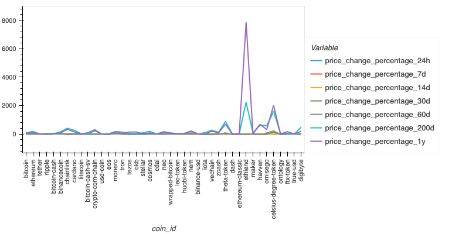
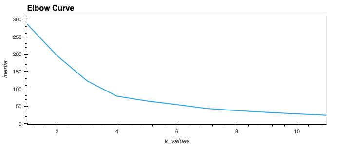
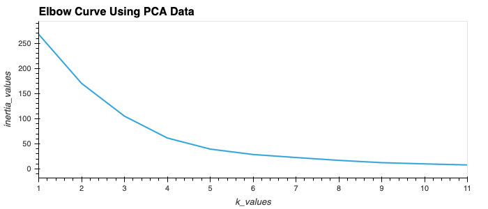
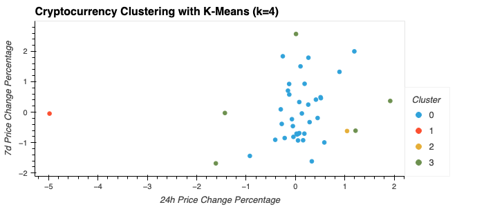

# Module10

<plot>
  <tr>
    <td colspan="2">  </td>
  </tr>

<plot>
  <tr>
    <td colspan="2">  </td>
  </tr>
  
<plot>
  <tr>
    <td colspan="2">  </td>
  </tr>
  
<plot>
  <tr>
    <td colspan="2">  </td>
  </tr>
